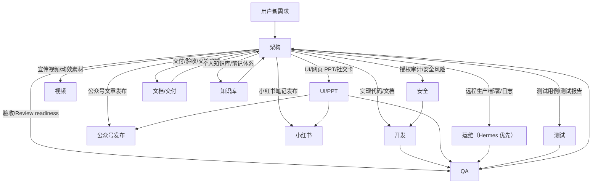

# Codex Skills

个人沉淀的 Codex skills 公共仓库。

这个仓库用于保存可公开复用的技能目录，方便在不同 Codex 环境、远程 Hermes 服务器和新机器之间同步。每个 skill 都应是一个可以独立复制到 `${CODEX_HOME:-$HOME/.codex}/skills/` 的目录。

推荐先阅读 [角色分工与推荐使用方式](docs/role-usage.md)：本地 Codex 主要承接架构、开发、UI/PPT、视频、公众号发布、小红书、文档/交付、知识库、安全、测试和 QA；服务器侧 Hermes agent 优先承接运维只读诊断、部署检查和发布验证。

## 快速使用

推荐把这个仓库当成“角色 + skill 工具箱”使用：

| 场景 | 推荐入口 | 运行环境 |
| --- | --- | --- |
| 新需求、需求拆分、多窗口协作 | `$agent-role-orchestrator`，先走 `架构` | Codex 本地窗口 |
| gstack 产品/架构/工程/设计/QA 方法论审查 | `$gstack` 路由到具体 `$gstack-*` 子方法 | Codex 本地窗口 |
| 代码实现、文档修改、测试执行 | `开发` 角色提示词 | Codex 本地窗口 |
| UI、网页 PPT、社交卡、公众号封面 | `UI/PPT`，按任务路由到 `design-taste-frontend` / `guizang-ppt-skill` / `guizang-social-card-skill` | Codex 本地窗口 |
| 公众号文章排版、草稿、预览和授权发布 | `公众号发布` 角色提示词，默认用 `$wechat-ai-app-ops` | Codex 本地窗口 |
| 小红书笔记、图文组图、标题标签和发布格式 | `小红书` 角色提示词，可单独唤起；发布前用 `xhs-publish-assistant` 输出复制包 | Codex 本地窗口 |
| 交付清单、验收表、演示脚本和交接文档 | `文档/交付` 角色提示词，默认用 `$delivery-document-package` | Codex 本地窗口 |
| Obsidian/个人知识库整理、索引和标签体系 | `知识库` 角色提示词 | Codex 本地窗口 |
| 部署检查、发布验证、日志/cron/服务诊断 | Hermes-owned 运维 skills | 服务器侧 Hermes agent 优先 |
| 测试用例、测试报告、证据包 | `$test-case-report-builder`，由 `测试` 角色承接 | Codex 本地窗口 |
| Review readiness、验收缺口、阻塞风险 | `QA` 角色 | Codex 本地窗口 |
| 授权安全审计 | `authorized-blackbox-web-security` 或 Codex Security 系列 | Codex 本地窗口，必要时低影响远端验证 |

常用调用示例：

```text
使用 $agent-role-orchestrator，先按架构角色梳理这个需求，并判断是否需要开发/UI/公众号发布/小红书/测试/运维窗口。
```

```text
使用 $agent-role-orchestrator，给我公众号发布窗口。
```

```text
使用 $agent-role-orchestrator，给我小红书窗口。
```

```text
使用 $guizang-social-card-skill，把这篇文章做成一套小红书 3:4 图文。
```

```text
给 Hermes 运维 agent 一个部署后只读验证提示词，使用 post-deployment-readonly-verification 的边界。
```

## 角色关系

一条新需求默认先进入 `架构`，由 `架构` 判断是否需要启用其他角色。新本地代码项目会先检查或初始化 CodeGraph；需求确认到足以描述问题后，`架构` 默认先做一轮有边界的开源/可借鉴方案扫描，再锁定设计或拆给下游。已经建立过的角色默认走 `继承` / `接续`，不要重复新建；只有用户或 `架构` 明确要求并行时才开 `开发1号`、`开发2号` 这类编号窗口。下游窗口完成、阻塞或需要决策时，默认回调任务发起窗口，不无条件回报给 `架构`。

这套多窗口协作按 `loop engineering` 管理，而不是只做并行聊天。非平凡多窗口任务要显式维护闭环状态，例如 `待拆解`、`已派发`、`执行中`、`开发完成`、`QA 未通过`、`返工中`、`QA 通过`、`架构终验`、`完成` 或 `阻塞`。`QA` 或发起窗口打回问题时，反馈必须结构化：说明问题/缺口、证据或复现、影响等级、建议回流对象、是否需要决策、下一闭环状态。闭环结束时，`架构` 或最终协调窗口要判断是否有可复用经验需要沉淀到 skill、README、角色提示词、QA 清单、验证命令或项目文档中。



角色之间的基本关系：

- `架构` 是入口和分流者，负责需求澄清、新项目 CodeGraph 启动、开源/可借鉴方案扫描、边界判断、角色台账、文件范围、验收标准和下游提示词。
- `agent-role-orchestrator` 生成下游角色提示词时会加入回调/通知规则：谁指派任务，谁就是默认回调对象；只有架构是发起方、指定协调方或用户明确要求时，才默认回到架构。
- `开发`、`UI/PPT`、`UI/Frontend`、`视频` 是产物角色，只在 `架构` 给出的范围内执行；纯前端或视觉保真任务默认先让 `UI/PPT` / `UI/Frontend` 负责视觉方向。
- `公众号发布` 和 `小红书` 是预留的内容发布角色，可以由 `架构` 分流，也可以单独唤起；正式对外内容输出前必须先用 `humanizer-zh` 做去 AI 味，人设/叙事/对话类片段才按需补 `story-deslop`；默认只做草稿/预览/发布包，最终发布必须显式授权。
- `文档/交付` 负责客户交付材料、验收记录、演示脚本和交接清单；不替代法务、税务、QA 签收或开发事实确认。
- `知识库` 负责个人笔记库的目录、索引、标签、MOC 和链接整理；不删除、不公开、不把高风险个人笔记改写成专业建议。
- `运维` 优先交给服务器侧 Hermes agent；本地 Codex 主要负责编写 Hermes 提示词、判断回传证据和组织验收口径。
- `安全` 先走授权和范围确认，再调用安全专项 skill 或 Codex Security 插件。
- `测试` 负责正式测试资产，例如 Excel 测试用例、Word/DOCX 测试报告和测试证据包。
- `QA` 负责验收、Review readiness、阻塞风险和缺口确认，不默认写测试用例或测试报告。

## 角色下的 Skills

| 角色 | 默认入口 | 常用 skills | 备注 |
| --- | --- | --- | --- |
| `架构` | `$agent-role-orchestrator` | `$gstack`, `$gstack-office-hours`, `$gstack-spec`, `$gstack-autoplan`, `$gstack-plan-*`, `$startup-pressure-test` | 新需求先过架构；复杂需求先给多方案技术选型；新本地代码项目先检查或初始化 CodeGraph；需求确认后先做有边界的开源/可借鉴方案扫描；架构决定是否启用其他角色 |
| `开发` | 架构给出的开发提示词 | `$gstack-investigate`, `$gstack-review`, `$gstack-ship`, `$gstack-health`, `$gstack-careful`, `$gstack-guard`, `$playwright`, `$pdf` | 默认包含文件白名单、禁止范围、验证命令、提交要求 |
| `UI/PPT` / `UI/Frontend` | 架构给出的 UI/PPT 提示词 | `$gstack-design-*`, `$design-taste-frontend`, `$guizang-ppt-skill`, `$guizang-social-card-skill`, `$photo-to-cute-3d-toy`, `$playwright` | UI、网页 PPT、社交卡、公众号封面、照片到玩具资产规划和视觉验证 |
| `视频` | 架构给出的视频提示词 | `$hatch-pet`，以及可用的视频/HyperFrames 插件 | 宣传视频脚本、分镜、素材和渲染计划 |
| `公众号发布` | 架构给出或单独唤起的公众号发布提示词 | `$wechat-ai-app-ops`, `$wechat-tech-writer`, `$wechat-article-formatter`, `$humanizer-zh`；需要视觉资产时可交给 `UI/PPT` / `$guizang-social-card-skill` | 公众号 AI 应用文章、技术选题初稿、HTML 排版、周刊连续性、草稿箱、预览、素材检查和授权发布自动化 |
| `小红书` | 架构给出或单独唤起的小红书提示词 | `$cheat-on-content`, `$xhs-comment-research`, `$humanizer-zh`, `$guizang-social-card-skill`, `$xhs-publish-assistant`, `$playwright` | 小红书/Rednote 笔记、评论研究、图文组图、标题标签、发布复制包、内容实验和授权发布自动化 |
| `文档/交付` | 架构给出的文档/交付提示词 | `$delivery-document-package`, `$gstack-document-generate`, `$gstack-document-release`, `$gstack-learn`, `$gstack-retro` | 交付清单、验收材料、演示脚本、变更确认、操作指南和交接文档 |
| `知识库` | 架构给出或单独唤起的知识库提示词 | `$agent-role-orchestrator` 角色卡 | 个人知识库、Obsidian vault、索引/MOC、标签、链接和高风险笔记边界 |
| `运维` | Hermes handoff 提示词 | `$application-problem-diagnosis-workflow`, `$package-update-check-and-plan`, `$pre-deployment-readonly-checklist`, `$post-deployment-readonly-verification`, `$hermes-*`, `$proxy-dependent-python-service-diagnosis`, `$python-project-deployment-troubleshooting` | 远程生产事实由 Hermes 只读查；写操作必须授权 |
| `安全` | 安全审计提示词 | `$gstack-cso`, `$authorized-blackbox-web-security`, Codex Security 插件 skills | 黑盒、公网、仓库、PR、深度扫描要分开 |
| `测试` | 测试提示词 | `$test-case-report-builder`, `$playwright`, `$pdf` | 正式测试用例、测试报告和证据包归测试 |
| `QA` | QA/验收提示词 | `$gstack-qa-only`, `$gstack-qa`, `$gstack-canary`, `$gstack-review`, `$playwright`, Hermes 只读验证 skills | Review readiness、验收缺口、阻塞风险，不默认写测试报告 |

## 跨电脑继承

另一台电脑可以通过这个 Git 仓库完整继承“公开 skills + 角色分工 + registry + 使用文档”。继承范围包括 `skills/` 下的 60 个 active skills、`registry/skills.json`、角色关系和安装说明。

首次安装：

```bash
git clone git@github.com:Dirtytrii/codex-skills.git
cd codex-skills
python3 scripts/validate_public_skills.py
mkdir -p "${CODEX_HOME:-$HOME/.codex}/skills"
for d in skills/*; do
  [ -d "$d" ] || continue
  rsync -a --delete "$d/" "${CODEX_HOME:-$HOME/.codex}/skills/$(basename "$d")/"
done
```

更新已有机器：

```bash
cd codex-skills
git pull --ff-only
python3 scripts/validate_public_skills.py
for d in skills/*; do
  [ -d "$d" ] || continue
  rsync -a --delete "$d/" "${CODEX_HOME:-$HOME/.codex}/skills/$(basename "$d")/"
done
```

`--delete` 会让目标机器上的同名 skill 与仓库版本保持一致；如果目标机器上对同名 skill 做过私有改动，先备份或去掉 `--delete`。

安装后验证 active skills 是否都已继承：

```bash
python3 - <<'PY'
import json, os
from pathlib import Path

repo = Path.cwd()
home = Path(os.environ.get("CODEX_HOME", Path.home() / ".codex"))
registry = json.loads((repo / "registry/skills.json").read_text(encoding="utf-8"))
active = [item["name"] for item in registry if item.get("status") == "active"]
missing = [name for name in active if not (home / "skills" / name / "SKILL.md").is_file()]
print(f"active skills: {len(active)}")
print(f"installed active skills: {len(active) - len(missing)}")
if missing:
    print("missing:")
    for name in missing:
        print(f"- {name}")
    raise SystemExit(1)
print("OK: all active skills installed")
PY
```

这个仓库不能继承的内容：

- Codex 插件本身，例如 Browser、Build Web Apps、Canva、Codex Security、GitHub、HyperFrames、Documents、Spreadsheets 等，需要在目标机器单独启用。
- 本机私有 memory、Chronicle 屏幕历史、登录态、GitHub SSH key、API token、浏览器 cookie、`.codex/config`、自动化任务。
- 未纳入公开仓库的本机私有/实验 skill。当前本机额外存在 `chronicle`，不会随本仓库安装到其他电脑。
- 上游 `gstack` 的大体积浏览器/设计二进制运行时；本仓库沉淀的是适配后的方法论和角色入口。
- Hermes 服务器上的生产环境、服务状态、日志、密钥和运行时配置；这里只同步脱敏后的可公开运维 skill。

结论：只要目标机器已经有 Codex，并且需要的插件/凭据另行配置，通过本仓库可以完整继承当前这套公开 role skills。若目标机器只安装本仓库，不额外启用插件，那么插件型能力会在角色提示词里被提及，但不会自动变成可调用工具。

## Skills

完整机器可读清单在 [registry/skills.json](registry/skills.json)。当前 active skills 共 60 个，按使用方式分组如下：

| 分组 | 代表 skills | 来源 | 主要角色 |
| --- | --- | --- | --- |
| 角色编排 | `agent-role-orchestrator` | local | 架构 / 全角色 |
| gstack 方法论路由 | `gstack`，以及 `gstack-office-hours`、`gstack-spec`、`gstack-autoplan`、`gstack-plan-*` | external-github / adapted | 架构 |
| gstack 执行与复盘 | `gstack-investigate`、`gstack-review`、`gstack-ship`、`gstack-health`、`gstack-devex-review`、`gstack-careful`、`gstack-guard`、`gstack-freeze`、`gstack-unfreeze`、`gstack-learn`、`gstack-retro` | external-github / adapted | 开发 / QA / 架构 |
| gstack 设计 | `gstack-design-consultation`、`gstack-design-shotgun`、`gstack-design-html`、`gstack-design-review` | external-github / adapted | UI/PPT |
| gstack QA / 安全 / 发布门禁 | `gstack-qa-only`、`gstack-qa`、`gstack-canary`、`gstack-cso`、`gstack-setup-deploy`、`gstack-land-and-deploy` | external-github / adapted | QA / 安全 / 运维 |
| UI/PPT 生产 | `design-taste-frontend`、`guizang-ppt-skill`、`guizang-social-card-skill`、`photo-to-cute-3d-toy`、`playwright` | local / external-github | UI/PPT / 小红书 / 公众号发布 / 视频 |
| 公众号发布运营 | `wechat-ai-app-ops`、`wechat-tech-writer`、`wechat-article-formatter` | local | 公众号发布 / 架构 / UI/PPT |
| 中文文案人味化 | `humanizer-zh` | external-github | 小红书 / 公众号发布 / UI/PPT / 视频 |
| 中文叙事去 AI 味 | `story-deslop` | external-github / adapted | 架构 / 公众号发布 / 小红书 / 视频 |
| 社媒内容实验 | `cheat-on-content` | external-github / adapted | 小红书 / 架构 |
| 小红书发布格式与评论研究 | `xhs-publish-assistant`、`xhs-comment-research` | local | 小红书 / 架构 |
| 视频/视觉资产 | `hatch-pet` | local | UI/PPT / 视频 |
| 文档/交付 | `delivery-document-package` | local | 文档/交付 / 架构 |
| 安全审计 | `authorized-blackbox-web-security`，以及 Codex Security 插件 skills | local / plugin | 安全 |
| 测试资产 | `test-case-report-builder`、`pdf`、`playwright` | local / external | 测试 |
| Hermes 运维 | `application-problem-diagnosis-workflow`、`package-update-check-and-plan`、`pre-deployment-readonly-checklist`、`post-deployment-readonly-verification`、`hermes-*`、`proxy-dependent-python-service-diagnosis`、`python-project-deployment-troubleshooting` | hermes | 运维 / QA |

gstack 的完整角色映射见 [skills/gstack/references/methodology.md](skills/gstack/references/methodology.md)。本仓库保留的是 Codex 角色体系适配版，不内置上游大体积运行时、浏览器二进制、遥测或 host routing 自动注入。

暂不公开：

- `chronicle`：和本机屏幕录制/记忆能力绑定，公开复用价值低，容易造成误用。
- `.backup-*`：历史备份目录，不进入公开仓库。

## 目录结构

```text
.
├── skills/                 # 可复制安装的 skill 目录
├── registry/skills.json    # skill 清单和状态
├── docs/
│   ├── add-skill.md        # 新增 skill 的流程
│   ├── publication-checklist.md
│   ├── role-usage.md       # 角色分工和推荐运行环境
│   └── source-policy.md    # local / external / hermes 来源治理
├── scripts/
│   └── validate_public_skills.py
└── README.md
```

`skills/` 保持扁平结构：`skills/<skill-name>/SKILL.md`。如果某个 skill 自带 `references/`、`assets/`、`scripts/`、模板或校验脚本，整目录一起复制；不要只复制 `SKILL.md`。例如 `gstack` 的共享方法论在 `skills/gstack/references/methodology.md`，各 `gstack-*` 子 skill 会引用它。

单个 skill 的推荐结构：

```text
skills/<skill-name>/
├── SKILL.md               # 必需，frontmatter 至少包含 name 和 description
├── references/            # 可选，长说明和细分规则
├── assets/                # 可选，模板、图片、静态资源
├── scripts/               # 可选，辅助脚本
└── README.md              # 可选，上游或本仓库说明
```

## 安装

复制单个 skill：

```bash
mkdir -p "${CODEX_HOME:-$HOME/.codex}/skills"
rsync -a "skills/agent-role-orchestrator/" "${CODEX_HOME:-$HOME/.codex}/skills/agent-role-orchestrator/"
```

复制全部 active skills：

```bash
mkdir -p "${CODEX_HOME:-$HOME/.codex}/skills"
for d in skills/*; do
  [ -d "$d" ] || continue
  rsync -a "$d/" "${CODEX_HOME:-$HOME/.codex}/skills/$(basename "$d")/"
done
```

## Hermes 后续补充

Hermes 服务器有新的 skill 时，按这个流程加入：

1. 在 `skills/<skill-name>/` 下放完整 skill 目录；公开仓库保持扁平安装结构，Hermes 本地分类目录只记录在同步说明里。
2. 确保 `skills/<skill-name>/SKILL.md` frontmatter 至少包含 `name` 和 `description`。
3. 更新 `registry/skills.json`，填好 `origin_type`、`maintenance` 和 `consumed_by_roles`。
4. 运行：

```bash
python3 scripts/validate_public_skills.py
```

5. 按 `docs/publication-checklist.md` 做公开发布前检查。
6. 使用中文 commit message 提交。

## 公开发布原则

- 不提交 token、密钥、账号密码、生产域名凭据、内网地址、私有日志、截图原始敏感信息。
- 不提交 `.backup-*`、临时输出、生成图片缓存、运行时录屏、记忆文件。
- 第三方来源 skill 保留原始许可证、README 和 provenance。
- 外部 GitHub 来源 skill 使用 `origin_type=external-github` 标记；除兼容 Codex/Hermes 所需的适配外，不把它当成本地原创。
- 每个 skill 保持最小自洽：`SKILL.md` 必须能说明何时使用、怎么使用、边界和校验方式。

## 维护约定

- 新需求先过 `agent-role-orchestrator` 的 `架构` 角色。
- 新本地代码项目默认先检查或初始化 CodeGraph；未安装时提示安装，或在环境允许且安装方式明确时做用户级静默安装。
- `架构` 在需求确认到足以描述问题后，先做有边界的开源/可借鉴方案扫描；若网络不可用、用户禁用或上下文敏感，需要写明跳过原因。
- 已建立角色默认走继承/接续，不重复新建窗口。
- 下游角色窗口默认回调任务发起窗口；不要把所有完成/阻塞/决策消息都默认交回架构。
- 非平凡多窗口任务必须携带闭环状态和本轮退出条件；状态可从 `待拆解`、`已派发`、`执行中`、`开发完成`、`QA 未通过`、`返工中`、`QA 通过`、`架构终验`、`完成`、`阻塞` 中取最小必要集合。
- QA、架构或发起窗口给出的返工反馈必须结构化，至少包含问题/缺口、证据/复现、影响等级、建议回流对象、需要决策和下一闭环状态。
- 每个闭环结束时都要判断是否需要规则沉淀；可沉淀到 skill、README、角色提示词、QA 清单、验证命令或项目文档，只有在用户授权或任务明确要求时才直接修改。
- `架构` 在非平凡实施计划进入开发前，可使用 `gstack` 路由到 `gstack-office-hours`、`gstack-spec`、`gstack-autoplan` 或具体 `gstack-plan-*` 审查。
- `运维` 优先使用 Hermes-owned 的只读诊断/部署检查 skills；涉及写操作、重启、清理、迁移时必须先获得用户明确授权。
- 安全审计默认委派到安全专项 skill。
- `测试` 生成测试用例/测试报告默认使用 `test-case-report-builder`。
- `QA` 保持验收/Review 角色，默认不负责写测试用例和测试报告。
- 使用中发现可复用优化时，优先沉淀回对应 skill。
